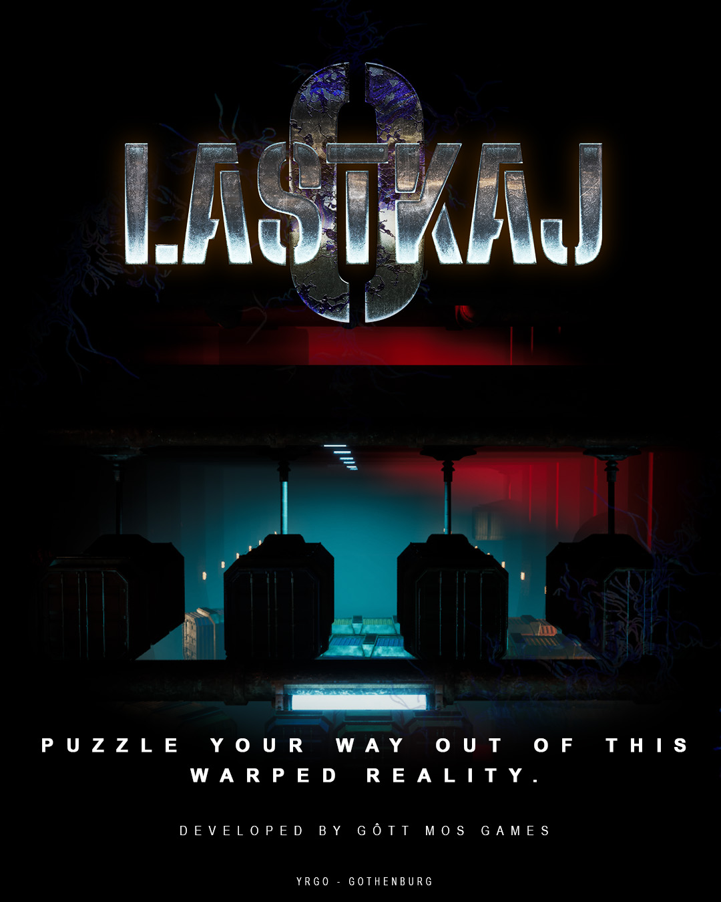

# ***Lastkaj 0***

[Website](https://yrgo.itch.io/lastkaj-0)  

## Overview
Worked as **Project Lead and Gameplay/Systems programmer**  
In development between: *April -26 -> June -26*

In Lastkaj 0 the player takes on the role as a cargo inspector entering cargo containers with warped reality.
Equipped only with his/hers multitool the inspector has to figure out a way to retrieve the anomalies hidden inside. 
Each container presents itself with new challenges to overcome, emersing the player in a challenging 3D puzzle environment

## Gameplay

<table>
  <tr>
    <td ></td>
    <td ></td>
  </tr>
</table>

**Titel**
- På saker jag gjorde

---

## Game Design

<table>
  <tr>
    <td ></td>
     <td ></td>
  </tr>
</table>
