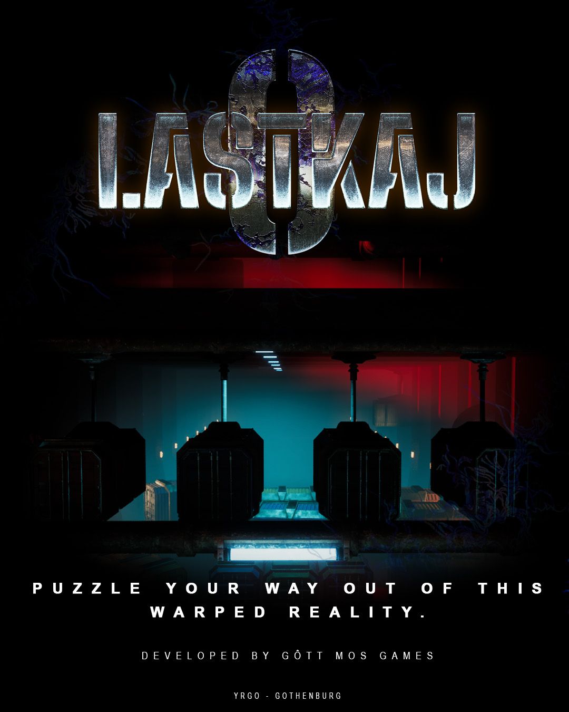

# ***Lastkaj 0***

[Website](https://yrgo.itch.io/lastkaj-0)  

## Overview
Worked as **Project Lead and Gameplay programmer**  
In development between: *April -26 -> June -26*

In Lastkaj 0 the player takes on the role as a cargo inspector entering cargo containers with warped reality.
Equipped only with his/hers multitool the inspector has to figure out a way to retrieve the anomalies hidden inside. 
Each container presents itself with new challenges to overcome, emersing the player in a challenging 3D puzzle environment

---

<table>
  <tr>
    <td ></td>
    <td ></td>
  </tr>
</table>

---

## My Contributions

**Project Lead**
---
During the 8 weeks this project were in development I took on the role as Project Lead. As this was a student project there was a sense of democracy and each individual had equal chance for input to affect the direction of the project. I held weekly meetings to maintain a professional structure and keep the project on track.

I tracked the progress of individual tasks and set up priority lists to ensure a smooth development that align with weekly goals set in the aforementioned meetings.

We also held weekly playtests. These playtests were evaluated during our meetings. With the help of my team, I evaluated the feedback from the players - transforming the opinions into valuable information that helped shape the outcome of the project.

---

**Gameplay programmer**
---
During early development I worked a lot with the firearm presented in the game, the SMT. The functionality of the SMT evolved constantly the first few weeks. From a projectile based weapon into what became the center piece of all puzzle's presented.

The end result of the SMT is that by line tracing it can activate and deactivate certain objects. Too add complexity to the puzzles we chose to have two "charges" meaning you did not have to activate each object immediately. This presented a challenge in form of player feedback that I had to solve.

The SMT features a small screen and two LED's that I applied logic for. The screen lights up when aiming at a valid target, ergo a target the player can activate and the LED's indicate the charge state for each charge. It was an interesting challenge to make the SMT stand out, due to it being static in front of the player. It was often overlooked so the details had to be just right. For example the LED had to glow bright enough to stand out, but not overpower to overpower the vision of the player. It also had to illuminate at the right rate. Too slow and no one would notice, and if it were too fast it felt unnatural.

My main contributing however was our containers.
Each cargo container is it's own puzzle and thus had to be:
- Larger on the inside, so we had enough space to present the player with an interesting puzzle and sell the illusion of something otherworldly.
- Presented in the correct order, leading to the correct space. So that we could introduce them in increasing complexity and slowly introduce new mechanics.
- Versatile to change as feedback from our playtests would introduce constant change to the pacing of the game.
- Able to show the inside of each container. to further improve the illusion of them being bigger on the inside.

I developed a data table that allowed my level designer to simply enter an integer as ID for each level/container. I chose to spawn each container at a height, thus being able to lower them individually making them accessible to the player when I wanted. As the goal for the player was to retrieve an anomaly from each container it became trivial to lower each container in the correct order. I used a day/night cycle to load / unload the containers. Allowing me to spawn them 4 / 5 at a time. 
The data table contained information about how many containers to spawn each day, and what ID each container had. Making it trivial to change how many levels we had and when to present the levels to the player. Upon meeting the progress criteria for each container, it would lower itself from the ceiling. Allowing the player to access the next puzzle. 

The "bigger-on-the-inside" effect was obtained by teleporting the player from the main play area to subareas. This also allowed me to load / unload certain areas of the game. Making it run more smooth. I developed a portal effect with the Unreal Engine Niagara system. When the player walks close to an active container, the corresponding puzzle would be loaded into memory and a second camera (located in the puzzle area) would read the position of the player and display the inside of the puzzle area.

---

**Other**
---
I also had a hand in level design. Producing a few levels that either introduces a new concept of the SMT to the player or utilizing all of the functions the SMT has to offer.
I am especially proud of one puzzle, the last one featured in the game (at the moment of writing) forcing players the use the same area of the container for multiple purposes. Thinking trough the order of activations and what objects are available to them at any given time are key to solve that level. 

